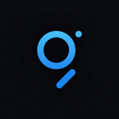

# Subgraph-template

<div align=center style="background:lightgrey">

</div>
<div align=center>


</div>

[English](./README.md) | 简体中文


TheGraph 公开了一个 GraphQL 端点，可查询xxx区块链和xxx生态系统中的事件和实体。

当前有多个子图，可以按照当前的架构向该存储库添加其他子图。


## 子图列表

01. **[Demo](https://thegraph.com/hosted-service/subgraph/lingcoder/xxx)**: Tracks data for Demo.


## 依赖项目

- [Graph CLI](https://github.com/graphprotocol/graph-cli)
    - Required to generate and build local GraphQL dependencies.

```shell
yarn global add @graphprotocol/graph-cli
```

## 子图部署


对于任何一个子图：将`[子图]`替换成具体的名称

1.  运行 `cd subgraphs/[subgraph]` 命令 进入子图目录。
    
2.  运行 `yarn codegen` 命令，为GraphQL准备TypeScript源代码（generated/\*）。
    
3.  运行 `yarn build` 命令 编译子图，并在部署前检查编译错误。
    
4.  运行 `graph auth --product hosted-service '<ACCESS_TOKEN>'`
    
5.  通过 `yarn deploy` 部署。
